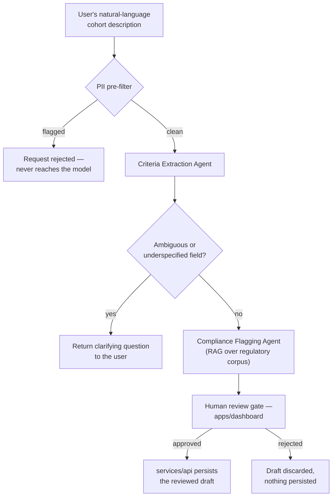

# Chorus — AI architecture

## Purpose

This document defines how `services/ai` is built: its agent structure, prompt design principles, memory boundaries, guardrails, privacy posture, hallucination mitigation, retrieval strategy, and evaluation process. The single constraint every section here answers to, restated from `PRODUCT_SPEC.md`'s product principles: **AI assists; it does not decide.** Nowhere in this architecture does a model have write access to a database, signing authority over a transaction, or the ability to persist anything without an explicit human action.

## Context

`services/ai` (Python, FastAPI, LangGraph) serves two capabilities: turning a natural-language cohort description into a structured, reviewable draft, and flagging likely HIPAA/GDPR/EHDS issues in that draft against a maintained regulatory corpus. Both are advisory. Neither has ever, at any point in the roadmap, been scoped to expand into an autonomous decision-maker — that boundary is architectural, not a temporary MVP limitation to be lifted later.

## AI architecture overview

The service is built as a LangGraph graph rather than a single prompt-and-response call, because the two capabilities above genuinely require multi-step reasoning with a human checkpoint in the middle — a single large prompt trying to do extraction, ambiguity detection, and compliance checking at once would be harder to evaluate, harder to debug when it's wrong, and harder to keep each step provably bounded to its stated capability.

## Agents

| Agent | Responsibility | Boundaries |
|---|---|---|
| **Criteria Extraction Agent** | Parses free-text into the structured cohort-criteria schema shared with `packages/types` | Structured-output only; any field that doesn't validate against the schema is dropped, not "corrected" by the model |
| **Ambiguity Resolution Agent** | Identifies underspecified or contradictory criteria and generates a clarifying question rather than guessing a default | Never fills a gap with an assumed value; an ambiguous field is surfaced to the human, not silently resolved |
| **Compliance Flagging Agent** | Checks a draft against a retrieved, jurisdiction-scoped set of HIPAA/GDPR/EHDS provisions | Every flag must cite a retrieved source; an ungrounded flag is suppressed, never shown — see Hallucination mitigation |
| **Review Orchestrator** | Coordinates the above and prepares the final package for the human review gate | Has no persistence capability of its own — `services/ai` holds no database credentials at all; only `services/api`, called after human approval, can write |

## Prompts

Every agent's prompt follows the same four-part structure, versioned in a config store (not hardcoded inline in application code) so that any prompt change is a reviewable, auditable diff rather than a silent behavioral change buried in a code commit:

- **Role** — a narrow, explicit statement of what this agent is and is not ("You extract structured cohort criteria from clinical research descriptions. You do not answer clinical questions, recommend treatments, or provide medical advice.")
- **Context** — the schema or regulatory scope the agent operates against, injected per-request (the cohort schema for extraction, the retrieved regulatory chunks for compliance flagging).
- **Constraints** — hard boundaries stated explicitly and redundantly with the system-level guardrails below, on the theory that a model instruction is a second layer of defense, never the only layer.
- **Output format** — a strict schema the response must conform to; the calling code validates against this schema regardless of what the model claims to have produced.

Extraction-agent generation uses low, near-deterministic sampling settings — structured extraction benefits from consistency across near-identical inputs in a way that creative generation does not, and unpredictable extraction behavior would make the evaluation process below far noisier than it needs to be.

## Memory

Session state — the current cohort-drafting conversation only — is held server-side, keyed by session ID, and expires after a short inactivity window. There is no long-term, cross-session memory of any specific user's past interactions used to influence future outputs: no fine-tuning on user-submitted content, no vector store of past conversations, no user-specific behavioral profile. This is a deliberate privacy-by-default choice, not a missing feature — the moment `services/ai` starts remembering what a specific compliance officer asked last month, it becomes a second place patient-adjacent context could accumulate and leak, which is exactly the failure mode the rest of this architecture is built to prevent.

## Guardrails

Three independent layers, each sufficient on its own, deliberately redundant:

1. **Input guardrail.** A lightweight PII/PHI pattern detector runs before any text reaches a model call — names, MRNs, date-of-birth patterns, and similar direct identifiers trigger an outright rejection (`422 PII_DETECTED`, per `API_SPEC.md`), not a redaction-and-continue. Even a redacted version of PHI having touched a third-party model API is a boundary crossed that the architecture is built to make impossible, not merely unlikely.
2. **Output guardrail.** Every structured response is validated against the same schema `services/api` and `packages/types` enforce. A response that doesn't validate is discarded; the model is never trusted to self-correct a malformed output by asking it to "try again" with the same prompt, since that pattern tends to produce a plausible-looking but still-wrong retry rather than a genuinely corrected one.
3. **Action guardrail.** `services/ai` has zero write credentials to any datastore. It can only return a suggestion object over the network to `services/api`, which requires an explicit, human-triggered request to persist anything. This is enforced at the infrastructure level (no database connection string is ever provisioned to this service), not merely as an application-level convention that a future change could quietly erode.

## Privacy

`services/ai`'s input surface is strictly limited to free-text cohort descriptions (post PII-filter) and existing structured criteria objects for editing — it never receives patient records, model gradients, or proof contents, all of which live entirely within `packages/node` and the blockchain layer described in `BLOCKCHAIN_ARCHITECTURE.md`. Given the PII pre-filter's guarantee, a Business Associate Agreement with the third-party model provider (Anthropic/OpenAI, per the technology stack) is not strictly required for HIPAA purposes — but Chorus pursues one anyway as defense-in-depth, on the reasoning that a guardrail is worth having even when a different guardrail should already prevent the scenario it covers.

## Hallucination mitigation

- **Structured output only.** A hallucinated field fails schema validation and is dropped rather than silently entering a persisted record.
- **Grounded citations only.** The Compliance Flagging Agent may only surface a flag it can tie to a specific retrieved passage; the retrieval step's failure to find a supporting source suppresses the flag entirely rather than letting the model reason freely about a compliance concern with no citation behind it.
- **Human-in-the-loop as the final backstop.** The system's design assumes the model will sometimes be wrong, and is built so that being wrong costs a human a review click — never a silent, unreviewed bad outcome. This is treated as the primary mitigation, not a fallback for when the first two fail; the first two exist to make the human's review faster and more trustworthy, not to make the human's review optional.

## RAG strategy

The knowledge base is a static, versioned regulatory corpus — HIPAA text, relevant GDPR articles, the EHDS regulation, and Chorus's own internal compliance-mapping documentation (`docs/public/compliance/`) — chunked and embedded using Voyage AI's embedding models (Anthropic's recommended embedding partner, a deliberate, specific choice rather than a placeholder). Retrieval is scoped per query: only chunks relevant to the specific criteria fields present in the draft and the institution's declared jurisdiction are retrieved, not a blind whole-corpus search — this both improves relevance and keeps the Compliance Flagging Agent's context tightly bounded to what it's actually allowed to reason about. The vector index runs on `pgvector` inside the existing PostgreSQL instance rather than a dedicated vector database — consistent with the broader infrastructure philosophy documented in `SYSTEM_ARCHITECTURE.md` of not adding new infrastructure surface area before there's a demonstrated need for it. **This RAG pipeline never indexes user-submitted cohort content** — only the static regulatory corpus is embedded and retrievable, which is what makes the "never leaks patient-adjacent content into a shared index" guarantee structurally true rather than a matter of careful prompt-writing.

## Evaluation

A golden test set — representative cohort descriptions with expert-labeled expected structured output, built jointly with a compliance officer rather than by engineers alone — runs in CI against every prompt or model change, with two headline metrics: field-level extraction accuracy against the golden set, and compliance-flag precision/recall, also against the golden set. The acceptable trade-off between precision and recall is stated explicitly rather than left to whichever the model happens to produce: **the system is deliberately biased toward recall** — over-flagging is an inconvenience a human reviewer clears in seconds; under-flagging is a missed compliance issue that reaches production. No prompt or model change ships to production without passing this regression suite, enforced the same way any other Definition of Done requirement is enforced in the engineering backlog. In production, the human-override rate — how often a compliance officer edits or rejects a copilot suggestion — is tracked as an ongoing quality signal independent of the offline golden set, since a rising override rate on previously well-scoring inputs is often the earliest sign of drift the offline suite hasn't caught yet.

## Future considerations

As the v2.0 multi-jurisdiction compliance engine expands the regulatory corpus well beyond HIPAA/GDPR/EHDS, retrieval scoping by jurisdiction (already built into the RAG strategy above) becomes load-bearing rather than a nice-to-have — this is a case where an MVP-stage design decision was made anticipating a requirement two years out, precisely because retrofitting jurisdiction-scoped retrieval into an unscoped index later would mean re-architecting the retrieval layer rather than simply expanding the corpus it already scopes against.
