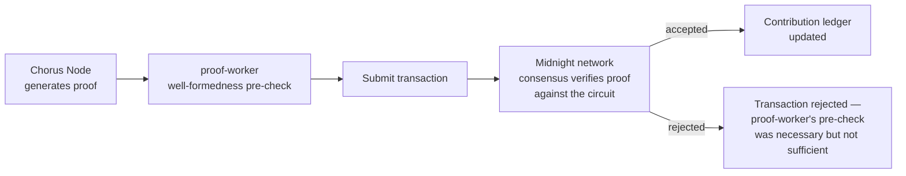

# Chorus — Blockchain architecture

## Purpose

This document describes how Midnight's confidential smart contracts integrate with the rest of the system — which contracts exist, what each one discloses and to whom, how off-chain services relate to on-chain verification, and how keys and settlement are handled. It assumes familiarity with `SYSTEM_ARCHITECTURE.md`'s event-flow and data-flow diagrams and goes one level deeper on the blockchain layer specifically.

## Context

Midnight was chosen — see `README.md`'s "Why Midnight" — because it is the only platform that puts private computation, explicit bounded disclosure, and programmable settlement in one execution environment. Every decision in this document exists to preserve that combination; a design that quietly moves any of the three back off-chain (for convenience, for speed, for familiarity) is a regression against the entire premise of the product.

## Contract inventory

| Contract | Purpose | Private state | Public state written | Who can call it |
|---|---|---|---|---|
| **Eligibility record** | Attests that a hospital's cohort satisfies a defined criterion, without revealing the underlying patient data or exact count | Patient-level matching computation (never leaves the eligibility circuit) | A boolean attestation, a criterion hash, and a k-anonymized size bucket | Any `hospital_admin`-authorized identity, via a Chorus Node-signed transaction |
| **Contribution ledger** | Records a verified federated-learning contribution to a cohort's training round | The model update itself, and the training-correctness proof witness | A contribution hash, round number, contributing org identity, and verification timestamp | `proof-worker`'s relay identity, only after off-chain pre-validation — see Verification flow below |
| **Payout** | Triggers and records a contribution-proportional payment | Contribution weighting inputs, if any are kept private per contract version | A payment amount, recipient org, settlement transaction reference | Triggered automatically by a valid write to the contribution ledger contract — never called directly by a person |

## Circuits

**Eligibility circuit.** Proves that a hospital's local patient population satisfies a defined criterion (e.g., "age 18–45, confirmed diagnosis X, no prior treatment Y") without revealing which patients, how many exactly, or any field not part of the criterion itself. Public inputs are the criterion definition (hashed); private inputs (the witness) are the hospital's local patient-matching computation. Output is a boolean plus a k-anonymized bucket, never an exact count — this mirrors the `sizeEstimate` behavior documented in `API_SPEC.md`'s cohort search endpoint, and it is not a coincidence: the API-level anonymization floor exists because the circuit itself never produces a precise number to begin with.

**Training-correctness circuit.** Proves that a submitted model update was computed correctly, using the eligible local data, following the training-correctness proof approach adapted from the VPFL/TrustDFL family of academic constructions referenced in the product strategy work. Public inputs are the prior model checkpoint hash and the claimed update hash; private inputs are the local training computation itself. This is the circuit that lets `proof-worker` reject a dishonest or poisoned contribution without ever seeing the data that would prove it dishonest by inspection — the proof itself is the evidence.

Circuit performance is the single highest-risk item in the entire roadmap (flagged as such in the engineering backlog's v0.8 milestone) — proving time for the training-correctness circuit scales with model size, and circuit design decisions made at v0.8 directly bound what model sizes are practical to support at v1.0. This is treated as a hard engineering constraint to design around, not a performance detail to optimize later.

## Verification flow: off-chain pre-check vs. on-chain truth

`proof-worker` does not have final authority over whether a proof is valid — Midnight's own contract execution does. `proof-worker`'s role is deliberately narrower: it performs an off-chain, fast well-formedness check (correct proof format, matching a currently-open training round, not a replay of an already-submitted proof) and then submits the transaction to the network. The Compact contract's own verifier is what actually accepts or rejects the proof as part of consensus. This distinction matters for the trust story: if `proof-worker` were the actual source of truth, Chorus would be asking hospitals to trust a server it operates — exactly the trust model federated learning was supposed to escape. By construction, `proof-worker`'s job is orchestration and UX (fast feedback, queueing, retries), and the network's job is the only verification that actually matters.

## Disclosure catalog

Every point at which a fact becomes visible outside its originating institution is an explicit, named `disclose()` call — there is no implicit disclosure path in any Chorus contract.

| Disclosure point | Contract | Triggered by | Visible to | What becomes visible |
|---|---|---|---|---|
| Eligibility attestation | Eligibility record | Hospital submits a cohort criterion match | Sponsor with an approved access request | Boolean match + k-anonymized size bucket — never exact count, never criterion detail beyond what the sponsor's request scoped |
| Contribution confirmation | Contribution ledger | Verified proof accepted | The contributing hospital, and the cohort's other verified contributors (aggregate only) | That a contribution occurred, its round number, and its verification timestamp — never the model update content |
| Regulatory audit query | Contribution ledger + Eligibility record | A `regulator`-role query through `apps/compliance` (see `API_SPEC.md`) | The querying regulator only, scoped to the specific query | Exactly what the query asked and nothing else — this is the on-chain anchor for the `scopedSummary` field documented in the compliance API |
| Payout settlement | Payout | Contribution ledger write | The receiving hospital, and — for basic amount/timestamp only, not the underlying contribution detail — any party with a legitimate financial audit reason | Payment amount, currency, settlement reference |

This table is the authoritative source for the marketing site's "Hospital view / Sponsor view / Regulator view" interactive demo — that UI is a direct visualization of these four rows, not a separate design artifact that happens to tell a similar story.

## Key management

Each hospital's Chorus Node generates and holds its own Midnight signing key **inside the hospital's own infrastructure**. Chorus's cloud never has signing authority over any institution's on-chain identity, and never sees a private key — Chorus Node signs transactions locally before they are relayed through `proof-worker` for submission. This is a non-custodial model by design: a hospital's compliance review should never have to ask "what happens if Chorus is compromised and can act as us," because the architecture makes that question inapplicable. Key rotation and loss-recovery procedures are documented for hospital IT administrators in `docs/public/developer-guide/`, treated with the same seriousness as any enterprise credential-recovery process, since a lost Chorus Node key without a recovery path would strand an institution's on-chain contribution history.

## Settlement asset

Payouts settle in a stablecoin bridged onto Midnight, not in NIGHT directly. A hospital's finance department needs to book contribution revenue predictably; asking a compliance-approved research collaboration to also absorb a native token's price volatility would undermine the "get paid automatically and transparently" value proposition documented in `PRODUCT_SPEC.md`. The specific bridge and stablecoin are an open item tracked as an Architecture Decision Record, to be resolved ahead of the v0.7 testnet integration milestone — the requirement (non-volatile settlement) is fixed; the specific implementation path is not yet, and shouldn't be guessed at here.

## Contract upgrade strategy

Compact contracts, once deployed, are treated as immutable — Chorus does not rely on upgradeable-proxy patterns for the core eligibility, contribution, or payout logic, since mutable contract logic sitting behind the trust story described in `README.md` would itself become a trust liability. Instead, a lightweight **registry contract** — deployed once, changed rarely, and itself subject to the highest level of review — points to the currently active version of each core contract. A new contract version is deployed alongside the old one, the registry is updated to route new transactions to the new version, and historical records tied to the prior version remain permanently readable against that version. This means a contract upgrade is additive to the chain's history, never a rewrite of it.

## Testnet and mainnet strategy

Contracts deploy to testnet at v0.7, alongside the first end-to-end proof flow using hand-prepared proofs. The zero-knowledge engine itself (v0.8) undergoes independent external audit before any pilot institution's real data touches the pipeline — this audit gate is a hard blocker in the engineering roadmap, not a target. Mainnet deployment at v1.0 requires a second, focused re-audit of anything that changed between the v0.8 audit and the mainnet candidate build, since re-auditing only the diff (rather than assuming the original audit still covers a modified contract) is the only way to avoid a false sense of security about code the auditors never actually reviewed.

## Security considerations

- **Replay protection:** every proof submission is bound to a specific `(cohortId, orgId, roundNumber)` triple, enforced both at the database layer (see `DATABASE_DESIGN.md`'s unique constraint) and at the contract layer — a resubmitted proof for an already-verified round is rejected by the network itself, not only by the API.
- **Front-running:** payout triggers are a deterministic function of a contribution ledger write, not a separately callable action — there is no transaction to front-run, because there is no discretionary step between verification and payout for an outside party to race.
- **Key compromise response:** a hospital IT administrator can revoke and rotate a Chorus Node key without losing access to prior on-chain history, since history is keyed to the org's on-chain identity, not to any single signing key — the recovery procedure is documented alongside the developer quickstart referenced in `README.md`.

## Future considerations

The v2.0 multi-jurisdiction compliance engine, described in `SYSTEM_ARCHITECTURE.md`'s future scalability section, will require the disclosure model above to express country-specific rules (which fields a regulator in a given jurisdiction may query, under what conditions) as contract configuration rather than as a forked contract per country. This requirement should inform circuit and contract design decisions made as early as v0.8, even though the multi-jurisdiction feature itself ships two years later — retrofitting configurability into a contract that was designed assuming a single jurisdiction is a much harder migration than designing for it from the start and simply not exposing the configuration surface until it's needed.
