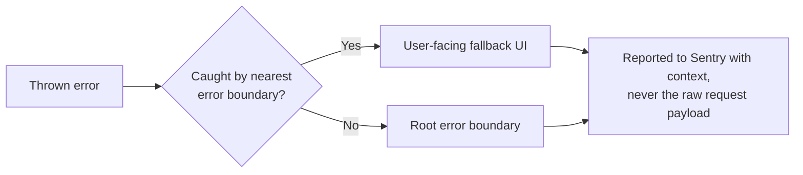

# Chorus — Coding standards

## Purpose

This document defines TypeScript and React conventions for the frontend and shared packages of the monorepo (`apps/*`, `packages/*`, and the TypeScript parts of `services/*`). It is scoped deliberately: `services/ai` is Python and follows a separate standards document once that service has enough surface area to warrant one. Where this document is silent, the linter configuration in `packages/config` is the tiebreaker, not personal preference.

## Context

Antigravity and human contributors will both generate code against this document. Consistency here matters more than any individual rule being objectively "best" — a codebase where every file makes the same choices is easier for an AI agent or a new engineer to extend correctly than one where equally valid conventions are mixed.

## Language & tooling baseline

TypeScript strict mode is non-negotiable (`strict: true` in every `tsconfig.json`, inherited from `packages/config`). `any` is banned by lint rule; if a type genuinely can't be known, use `unknown` and narrow it. ESLint and Prettier configs live in `packages/config` and are never overridden per-app — a per-app override defeats the purpose of a shared config and is a sign the shared config needs to change instead.

## Naming conventions

| Element | Convention | Example |
|---|---|---|
| Component files | PascalCase, matches the exported component | `CohortCard.tsx` |
| Non-component files (utils, hooks, config) | kebab-case | `format-currency.ts` |
| Hooks | `use` prefix, camelCase | `useCohortStatus.ts` |
| Types / interfaces | PascalCase, no `I` prefix | `interface CohortCriteria`, not `ICohortCriteria` |
| Booleans (props, variables) | `is`/`has`/`should` prefix | `isVerified`, `hasPendingProof` |
| Constants (true constants, not config objects) | SCREAMING_SNAKE_CASE | `MAX_COHORT_SIZE` |
| Event handler props | `on` prefix; handler implementations `handle` prefix | prop: `onApprove`, implementation: `handleApprove` |

**Why no `I` prefix on interfaces:** the codebase treats `type` and `interface` as interchangeable style choices scoped to "interface for object shapes that might be extended, type for everything else" — prefixing one but not the other adds noise without adding information TypeScript's tooling doesn't already surface on hover.

## File organization rules

Co-location over centralization: a component's test, Storybook story, and any component-specific styles live in the same folder as the component, not in parallel `__tests__/` or `stories/` trees. Barrel files (`index.ts` re-exports) are permitted **only** at a package's public boundary (`packages/ui/src/index.ts`, `packages/sdk/src/index.ts`) — never inside an app's internal feature folders. An internal barrel file inside `apps/dashboard/app/cohorts/components/index.ts` invites circular imports and defeats tree-shaking for no organizational benefit an explicit import path doesn't already provide.

```
packages/ui/src/
├── Button/
│   ├── Button.tsx
│   ├── Button.test.tsx
│   ├── Button.stories.tsx
│   └── button.variants.ts     // cva variant definitions, see COMPONENT_ARCHITECTURE.md
├── index.ts                    // the ONE barrel file — public package API only
```

## Component conventions

Function components only — no class components anywhere in the codebase, including error boundaries, which use a well-maintained functional wrapper rather than the class-based API React still technically requires for that one case. Props are typed via a `Props` interface (or `ComponentNameProps` when the component is exported and the plain name would collide), destructured directly in the function signature. Named exports are the default; default exports are used **only** where Next.js requires them (`page.tsx`, `layout.tsx`, `loading.tsx`, `error.tsx`). Named exports make renames and refactors traceable by every editor's "find references," where default exports can be silently renamed on import and drift from their source name.

```tsx
// Do
interface CohortCardProps {
  cohort: Cohort
  onApprove: (id: string) => void
}
export function CohortCard({ cohort, onApprove }: CohortCardProps) { /* ... */ }

// Don't
export default function(props: any) { /* ... */ }
```

## Error handling

Errors are never silently swallowed — an empty `catch {}` block is a lint error, not a style nit. Client-side, every route segment has an `error.tsx` boundary; server-side, every `services/api` handler that can fail returns a typed error shape rather than throwing an untyped exception across a service boundary. Every caught error that reaches an error boundary is reported to Sentry with the relevant context (org ID, route, and — critically — never the payload of the request itself, since that boundary sits close enough to user input that logging it risks logging something it shouldn't).



## Testing conventions

Vitest for unit tests, React Testing Library for component tests. Tests query by role and accessible name (`getByRole('button', { name: /approve/i })`), not by `data-testid`, except where no accessible query path exists — a component that can only be tested via `data-testid` is very often a component with an accessibility gap worth fixing first. Test names describe behavior, not implementation: `it('rejects a cohort criterion missing an age range')`, not `it('calls handleSubmit')`. Coverage percentage is not a target in itself; a file with 100% coverage and no assertions on behavior is worse than a file with 70% coverage that actually verifies the cases that matter.

## Git & PR conventions

Commits follow Conventional Commits (`feat:`, `fix:`, `chore:`, `docs:`, `refactor:`) — this is what drives `packages/*` versioning via changesets. Branch names are `type/short-description` (`feat/cohort-builder-nl-copilot`). Every PR description links back to the GitHub Project story it closes and states which Definition of Done items (from the engineering backlog) apply — a PR with no linked story is a signal the work wasn't planned, which is itself worth questioning before merge, not just after.

## Do & Don't summary

| Do | Don't |
|---|---|
| Use `unknown` and narrow it | Use `any` |
| Named exports, except Next.js special files | Default-export everything |
| Co-locate test/story/component | Maintain a parallel `__tests__` tree |
| Query tests by role/accessible name | Reach for `data-testid` as the default |
| Report errors to Sentry with route/org context | Log the raw request payload on error |

## Future considerations

A `PYTHON_STANDARDS.md` covering `services/ai` (ruff, mypy strictness level, LangGraph agent conventions) is planned once that service's surface area grows past its v0.5 scope — not written speculatively now. As `contracts/` code-generates `packages/contracts-client`, a short addendum on how generated code is exempted from certain lint rules (naming conventions generated code can't control) will be needed before v0.7 ships; tracked as a follow-up to this document rather than guessed at here.
