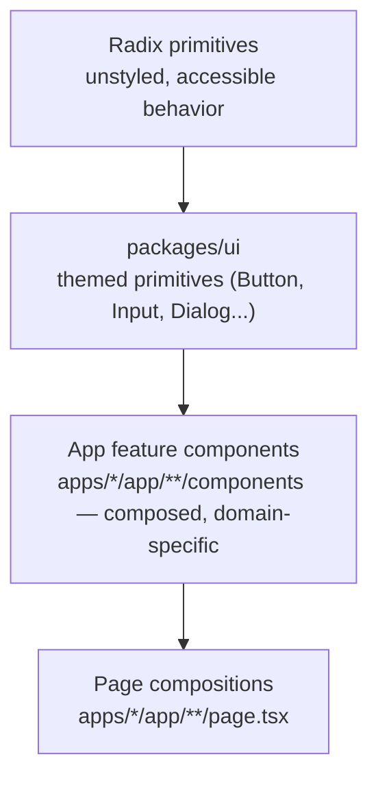

# Chorus — Component architecture

## Purpose

This document defines how components are structured, composed, and organized across `packages/ui` and each app's feature layer. `DESIGN_SYSTEM.md` defines what a component looks like; `CODING_STANDARDS.md` defines how its code is written; this document defines where a component lives, what tier it belongs to, and how tiers compose into a page.

## Context

Chorus's stack decision to build on shadcn/ui and Radix means most primitives already exist and are well-tested for accessibility — the job of this layer is disciplined theming and composition, not reinvention. The biggest risk in a system like this isn't missing components, it's uncontrolled proliferation: five slightly different card components because nobody had a rule for when a new one is justified. This document is that rule.

## Component hierarchy



**The rule that governs this diagram:** a component belongs in `packages/ui` only if at least two apps need it, or if it's a primitive so generic (Button, Input, Badge) that future reuse is a near-certainty. Everything else starts in the app that needs it, under that app's own `components/` folder. Promoting a component to `packages/ui` later, once a second consumer actually appears, is cheap; guessing wrong and over-abstracting a component only one app ever uses is not.

## Server vs. Client component boundary, at the component-tier level

`FRONTEND_GUIDELINES.md` sets the general Server-Component-by-default rule; here's how it maps onto the tiers above. Radix primitives and `packages/ui` components are written to work as either, since their consumer decides — a `Button` has no opinion about whether it renders inside a Server or Client Component tree. Feature components default to Server Components and only add `'use client'` at the specific leaf that needs interactivity (a filter dropdown inside an otherwise-static cohort list, for example). Page compositions (`page.tsx`) are Server Components essentially always — a page-level `'use client'` directive should be treated as a design smell worth a second look in review, not a default.

## Variant handling

Styled variants (a `Button` that can be `primary`, `secondary`, or `destructive`; a size that can be `sm`, `md`, `lg`) are handled with `class-variance-authority` (`cva`), not manual conditional `className` string-building. `cva` keeps variant logic declarative, type-safe (invalid variant combinations are a TypeScript error, not a runtime surprise), and colocated with the component it styles.

```ts
// packages/ui/src/Button/button.variants.ts
import { cva } from 'class-variance-authority'

export const buttonVariants = cva(
  'inline-flex items-center justify-center rounded-base transition-colors duration-fast',
  {
    variants: {
      intent: {
        primary: 'bg-text-primary text-canvas hover:opacity-90',
        secondary: 'border border-border-strong text-text-primary',
        destructive: 'bg-status-error text-canvas',
      },
      size: {
        sm: 'h-8 px-3 text-small',
        md: 'h-10 px-4 text-body',
      },
    },
    defaultVariants: { intent: 'primary', size: 'md' },
  }
)
```

**Don't:**
```tsx
// Don't hand-roll variant logic with string concatenation and ternaries.
const className = `btn ${intent === 'primary' ? 'btn-primary' : intent === 'secondary' ? 'btn-secondary' : 'btn-destructive'} ${size === 'sm' ? 'btn-sm' : 'btn-md'}`
```

## Composition patterns

Prefer composition via `children` and named slot props over a single component accepting a large, flat prop object. A component that needs more than three boolean props is very often a component that should be split, or should switch to the `cva` variant pattern above instead of adding a fourth boolean. For genuinely complex, multi-part components — the disclosure-model card from the marketing site is the canonical example, with its `Hospital view` / `Sponsor view` / `Regulator view` states — use the compound component pattern, so the parent owns shared state and each part is composable and independently testable:

```tsx
<DisclosureCard>
  <DisclosureCard.ViewSwitcher />
  <DisclosureCard.Field label="Diagnosis code" visibility="sponsor" />
  <DisclosureCard.Field label="Patient count" visibility="sponsor" redact="range" />
</DisclosureCard>
```

**Don't** collapse this into `<DisclosureCard view="sponsor" fields={[...]} redactCount showDiagnosis />` — a flat prop object like this is exactly the "boolean/config soup" this pattern exists to avoid, and it makes adding a fourth view a breaking change to every call site instead of an additive one.

## Props API conventions

Required props have no default; optional props have a sensible, explicitly documented default rather than relying on implicit `undefined` behavior. Every icon-only interactive element requires an `aria-label` prop at the type level — this is enforced by making `aria-label` a required prop on any `IconButton`-style component, not merely encouraged in a comment, so a missing label is a TypeScript error, not a runtime accessibility audit finding.

```ts
// packages/ui/src/IconButton/IconButton.tsx
interface IconButtonProps {
  icon: LucideIcon
  'aria-label': string   // required, not optional — see DESIGN_SYSTEM.md accessibility rules
  onClick: () => void
}
```

## File organization within a component

Every `packages/ui` component is a folder, not a single file, even when small — this keeps the co-location rule from `CODING_STANDARDS.md` consistent regardless of component complexity:

```
Button/
├── Button.tsx
├── button.variants.ts
├── Button.test.tsx
├── Button.stories.tsx
```

Feature components in `apps/*` follow the same shape minus the mandatory `.stories.tsx` (Storybook coverage is required for `packages/ui`, optional but encouraged for complex feature components — see below).

## Naming conventions

Follows `CODING_STANDARDS.md` directly: component folder and file name match the exported component in PascalCase (`DisclosureCard/DisclosureCard.tsx`), compound sub-components are dot-accessed on the parent export (`DisclosureCard.Field`) rather than separately exported (`DisclosureCardField`), which makes the parent-child relationship visible at the call site instead of only in the import list.

## Storybook requirement

Every `packages/ui` component ships a story before merge — this is a Definition of Done item, not a nice-to-have, because Storybook is both the living documentation Antigravity and human contributors reference when composing a new feature, and the baseline for visual regression review. A story is required to include, at minimum, the default state, every documented variant, and a disabled/error state where applicable.

## Accessibility contract per component

Before a `packages/ui` component is considered done, it must satisfy all of the following, and this checklist is what the required `axe-core` Storybook check (see `FRONTEND_GUIDELINES.md`) partially automates:

- Fully operable by keyboard alone, with a visible focus state using `--color-border-strong`.
- Has an accessible name — via visible text, `aria-label`, or `aria-labelledby` — with no exceptions for icon-only controls.
- Communicates state (error, success, verified) with more than color alone — an icon or text label always accompanies a status color.
- Respects `prefers-reduced-motion` for any animation the component owns.
- Passes `axe-core` with zero violations in its Storybook story.

## Testing requirements

Component tests use React Testing Library and query by role/accessible name, per `CODING_STANDARDS.md`. Every `IconButton`-style component has an explicit test asserting it has an accessible name — not just that it renders — since an icon button that renders but has no accessible name passes a naive "does it mount" test while failing every screen reader user.

## Do & Don't summary

| Do | Don't |
|---|---|
| Promote a component to `packages/ui` once a second consumer needs it | Build in `packages/ui` speculatively "in case it's reused" |
| Use `cva` for variants | Hand-roll conditional className strings |
| Use compound components for multi-part, stateful UI | Flatten complex UI into a large boolean/config prop object |
| Require `aria-label` at the type level for icon-only controls | Rely on a code review comment to catch a missing label |
| Ship a Storybook story with every `packages/ui` component | Merge a shared component with no story and no visual baseline |

## Future considerations

Visual regression tooling (Chromatic or an equivalent, snapshotting the Storybook stories required above) is worth adding once `packages/ui` has enough components that manual review of every PR's visual diff stops scaling — realistically around the v0.6–v0.7 mark, not before. Cross-app component usage should be tracked informally (a simple grep-based audit is sufficient pre-v1.0) to catch the case where a component was promoted to `packages/ui` prematurely and only ever gained its second consumer on paper.
