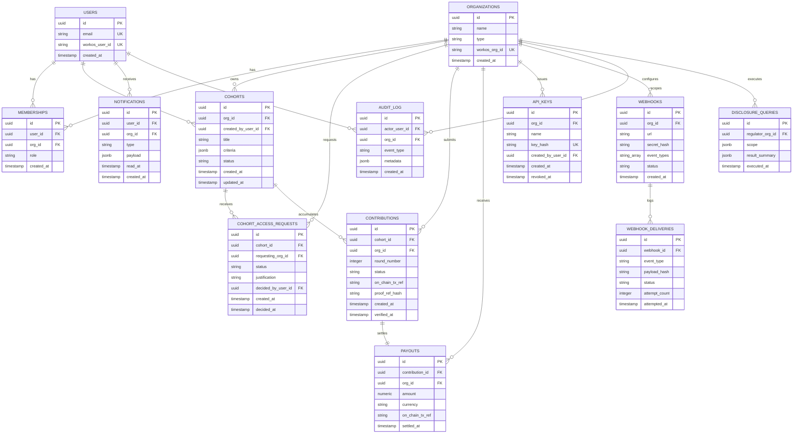

# Chorus — Database design

## Purpose

This is the relational data model for `services/api`'s PostgreSQL database. The single rule every other rule in this document exists to protect: **this database holds metadata only — organizations, sessions, criteria definitions, and references to on-chain records. It never holds patient-level data, raw model gradients, or proof witnesses.** Any proposed column that could contain patient-identifiable content is a design defect, not a review comment.

## Context

Postgres, accessed via Prisma, backs `services/api`. Redis (separately, not covered here) backs the BullMQ verification queue and short-lived cache. The schema below is deliberately metadata-heavy and reference-heavy — most "real" state about a contribution lives on the Midnight ledger; Postgres exists to make that state fast to query for a dashboard, not to be the source of truth for it.

## Entity-relationship diagram

## Entities

| Entity | Purpose |
|---|---|
| `organizations` | Every institution on the platform — hospital, biobank, sponsor, or regulator. `type` determines which roles and which app surfaces are valid for its members. |
| `users` | Individual accounts, one row per person, mirrored from WorkOS on first login. |
| `memberships` | The many-to-many join between users and organizations, carrying the role that governs authorization (see `API_SPEC.md`). A user can hold different roles at different organizations. |
| `cohorts` | Cohort criteria drafts and their lifecycle state (`draft` → `submitted` → `active` → `closed`). `criteria` is structured JSON matching the shared schema — never patient-level content, only field/operator/value criteria definitions. |
| `cohort_access_requests` | A sponsor's request to access a cohort, and the owning hospital's decision. |
| `contributions` | The off-chain mirror of a verified federated-learning contribution. The row is written only after `proof-worker` confirms verification (see `SYSTEM_ARCHITECTURE.md` event flow); `on_chain_tx_ref` is the authoritative pointer back to the Midnight ledger record. |
| `payouts` | The off-chain mirror of a settled, on-chain payment tied to a contribution. |
| `api_keys` | Developer-portal-issued credentials for Chorus Node and SDK integrations. Only a hash is ever stored — see Constraints. |
| `webhooks` / `webhook_deliveries` | Org-configured outbound event delivery and its attempt log. |
| `notifications` | In-app notification records for the notifications service. |
| `audit_log` | Append-only record of every auth and disclosure-relevant event — the backbone of `apps/compliance`'s and `apps/admin`'s audit surfaces. |
| `disclosure_queries` | Every query a regulator runs through `GET /v1/compliance/disclosures`, including queries returning zero results — the audit trail for the auditors themselves, so a regulator's access is as reviewable as everyone else's. |

## Relationships

`organizations` ↔ `users` is many-to-many through `memberships`, because a person can belong to more than one institution (a compliance consultant advising two hospitals, for example) and because role must be scoped per-organization, not per-user globally. `cohorts` belongs to exactly one owning `organizations` row, but can accumulate `contributions` from many organizations — this is the schema's expression of the product's core mechanic: one cohort definition, many institutions contributing verified updates against it. `contributions` to `payouts` is one-to-one for the MVP; a future split-payout model (a single contribution triggering payments to multiple stakeholders, relevant once the v1.5 marketplace introduces royalty splits) is a documented future migration, not built speculatively now.

## Indexes

| Table | Index | Reason |
|---|---|---|
| `memberships` | Unique composite `(user_id, org_id)` | A user cannot hold two conflicting rows for the same organization |
| `cohorts` | Composite `(org_id, status)` | The dashboard's primary query pattern is "this org's cohorts in this status" |
| `contributions` | Composite `(cohort_id, org_id, round_number)`, unique | Enforces one contribution per institution per round at the database level, not just in application logic — see Constraints |
| `contributions` | `(org_id, verified_at)` | Powers `GET /v1/orgs/:orgId/contributions` pagination sorted by recency |
| `api_keys` | Unique on `key_hash` | Key lookup on every API-key-authenticated request must be O(1) |
| `audit_log` | Composite `(org_id, created_at)` | Compliance and admin surfaces query by org and time range far more often than by any other dimension |
| `webhook_deliveries` | Partial index on `status = 'failed'` | The retry worker's query pattern only ever needs failed deliveries, not the full history |

## Constraints

- `api_keys.key_hash` stores only a hash (never the raw key — see `API_SPEC.md`, which returns the raw value exactly once at creation).
- `contributions` carries a unique constraint on `(cohort_id, org_id, round_number)` — an institution cannot submit two contributions to the same cohort in the same round, enforced at the database level so a race condition in the queue consumer can't produce a duplicate even if application-level idempotency somehow failed.
- `cohorts.criteria` is validated by a JSON Schema check constraint mirroring the same schema `packages/types` and `services/ai` validate against — the database is a second, independent enforcement point for the "criteria only, never patient data" rule, not merely a passive store trusting the application layer got it right.
- `organizations.type` and `memberships.role` are both constrained to enumerated values at the database level (Postgres `CHECK` constraints), not only validated in application code, for the same defense-in-depth reason.
- Every foreign key is `ON DELETE RESTRICT` by default — an organization or user cannot be deleted while it still has referencing rows (cohorts, contributions, audit entries). Deactivation is a status flag, not a row deletion; this preserves the audit trail's integrity, which is a compliance requirement, not just good practice.

## Future migrations

| Version | Migration | Why deferred until then |
|---|---|---|
| v0.9 | `reputation_scores` table (`org_id`, `score`, `computed_at`, `formula_version`) | The scoring formula itself is an open mechanism-design question — see `SYSTEM_ARCHITECTURE.md` roadmap — building the table before the formula is settled risks a schema that doesn't fit the eventual weighting logic |
| v1.5 | `model_licenses`, `royalty_distributions` tables, plus the split-payout model on `contributions` → `payouts` | Depends on the AI marketplace's licensing terms, which are a product decision not yet made |
| v2.0 | `jurisdiction_rules` table, and a `jurisdiction` column added to `cohorts` and `disclosure_queries` | The multi-jurisdiction compliance engine's data model depends on how Compact contracts end up expressing per-country disclosure rules — see `BLOCKCHAIN_ARCHITECTURE.md` future considerations — the database schema should follow that decision, not precede it |

Migrations run through Prisma Migrate, staged first against the staging environment described in `SYSTEM_ARCHITECTURE.md`. Every migration that alters or removes an existing column follows an expand-contract pattern (add the new shape, backfill, migrate reads, only then drop the old shape) rather than a single breaking change — this matters more here than in a typical SaaS schema, because `contributions` and `payouts` rows are permanent financial and audit records that must never be corrupted by a failed migration mid-flight.
