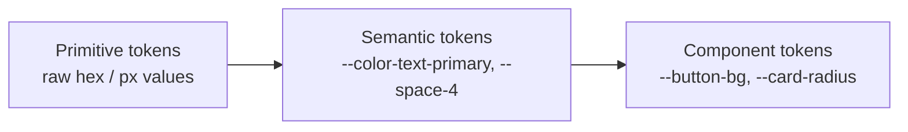

# Chorus — Design system

## Purpose

This is the implementable, code-ready reference for every visual token in the product. If a value used in a component doesn't trace back to a token defined here, that's a bug, not a style choice — the whole point of a token system is that "unique to this component" decisions require a deliberate, reviewed addition to this document, not a one-off hex code in a `className`.

## Context

The brand thesis, established during product design, is that privacy should be communicated through interaction and restraint, not iconography or metaphor. Two consequences follow directly into this document: color is almost entirely absent except where it carries real information (a single accent reserved for cryptographic verification moments), and the token architecture itself is three-tiered so that meaning, not decoration, is what components consume.



**Do:** consume semantic or component tokens in application code.
**Don't:** reference a primitive hex value or raw pixel number directly in a component. If a value isn't available as a semantic token, that's a request to add one — not a license to inline it.

## Design decisions

### Two-mode philosophy

`apps/web` is dark-first with no user-facing toggle — the marketing brand moment is a fixed creative decision, not a preference. `apps/dashboard`, `apps/research-portal`, `apps/compliance`, and `apps/admin` are light-first with a fully equivalent dark mode, because their users read dense data for hours in bright office lighting, and `apps/compliance` in particular serves auditors who may need to print or scan a screen for a record — light-mode-default is the safer accessibility baseline for that audience. Both modes are first-class; dark mode in the product apps is not an afterthought toggle, it's an equally maintained token set.

### Color tokens

Every pair below was checked against the WCAG 2.1 relative-luminance contrast formula, not assumed. Several dark-mode values are **not** simple inversions of their light-mode counterpart — a color that passes contrast on a near-white canvas frequently fails on a near-black one, and treating dark mode as "invert and ship" is the single most common accessibility regression in token systems that don't check this explicitly.

| Semantic token | Light | Dark | Contrast vs. canvas | Notes |
|---|---|---|---|---|
| `--color-canvas` | `#F5F4F0` | `#0A0A0A` | — | Base background |
| `--color-surface` | `#EDEBE4` | `#17161A` | — | Card / panel background |
| `--color-border-hairline` | `#D8D6CE` | `#2B2924` | 1.3:1 | Decorative dividers only — exempt from WCAG 1.4.11, never used on an interactive boundary |
| `--color-border-strong` | `#8A8778` | `#635F55` | ≥3.0:1 | Required on inputs, focus rings, and any card boundary that conveys structure a user depends on |
| `--color-text-primary` | `#0A0A0A` | `#F5F4F0` | ~18:1 | |
| `--color-text-secondary` | `#6B6960` | `#9C9A90` | Light 5.0:1 · Dark 7.0:1 | Independently verified per mode — see note below |
| `--color-accent-verify` | `#C97A3D` | `#C97A3D` | Light 3.0:1 · Dark 6.0:1 | See the verify-amber rule below |
| `--color-status-error` | `#9B3B34` | `#C2564D` | ≥4.5:1 both modes | Dark value lightened; the light-mode hex fails contrast on a near-black canvas |
| `--color-status-warning` | `#9C7A2E` | `#C79A46` | ≥4.5:1 both modes | Same reason |
| `--color-status-success` | `#4B7A5E` | `#6FA184` | ≥4.5:1 both modes | Same reason |

**Why `--color-text-secondary` isn't a straight invert:** `#6B6960` at 5.0:1 against light canvas passes WCAG AA for body text. Rendered as-is on the dark canvas, the same hex measures roughly 3.6:1 — below the AA text threshold. `#9C9A90` was chosen specifically to hit 7.0:1 (AAA) on dark, not because a rounder or more convenient number was available.

**The verify-amber rule.** `--color-accent-verify` is the only saturated color in the system and it is reserved, without exception, for moments where something has been cryptographically verified — a proof accepted, a disclosure granted, a payment settled. It is never used for hover states, active tabs, decorative accents, or general "this is important" emphasis. On light surfaces it measures 3.0:1, which is only sufficient for fills, icon strokes, and large text (≥24px) — never small body text. On dark surfaces it measures 6.0:1 and is safe for body-sized text too. This asymmetry is intentional and must be respected exactly as documented; do not use amber body text on a light surface because it "looks fine" in one screenshot.

### Typography

| Token | Family | Size / line-height / weight | Usage |
|---|---|---|---|
| `--font-display` | `'GT Sectra', Georgia, ui-serif, serif` | 56px / 1.05 / 500 | Hero and section headlines only |
| `--font-sans` (body default) | `'Suisse Int'l', Inter, ui-sans-serif, sans-serif` | — | Everything else |
| `--font-mono` | `'JetBrains Mono', ui-monospace, SFMono-Regular, Menlo, monospace` | — | Any measured value: timestamps, hashes, proof IDs, currency |

Scale: `display` 56/1.05/500 · `h1` 40/1.1/500 · `h2` 24/1.3/500 · `body` 16/1.5/400 · `small` 13/1.4/400 · `data` 14/1.4/400 (mono, `font-variant-numeric: tabular-nums` mandatory so columns of numbers align).

**Do:** ship with Inter as an interim substitute for Suisse Int'l until that license is purchased — the two are metrically close enough that layouts won't need rework when the swap happens.
**Don't:** substitute a different serif for GT Sectra without design review. The serif is the primary brand differentiator established in the marketing design work; swapping it changes what the brand communicates, not just how it looks.
**Don't:** use more than two font weights anywhere in the product (regular and medium). A bold weight reads as "trying to get your attention," which contradicts the brand's restraint principle.

```ts
// tailwind.config.ts (excerpt)
export default {
  theme: {
    extend: {
      fontFamily: {
        display: ['var(--font-display)'],
        sans: ['var(--font-sans)'],
        mono: ['var(--font-mono)'],
      },
      fontSize: {
        display: ['56px', { lineHeight: '1.05', fontWeight: '500' }],
        h1: ['40px', { lineHeight: '1.1', fontWeight: '500' }],
        h2: ['24px', { lineHeight: '1.3', fontWeight: '500' }],
        body: ['16px', { lineHeight: '1.5', fontWeight: '400' }],
        small: ['13px', { lineHeight: '1.4', fontWeight: '400' }],
        data: ['14px', { lineHeight: '1.4', fontWeight: '400' }],
      },
    },
  },
}
```

### Spacing

We use Tailwind's default spacing scale unmodified (`1`=4px, `2`=8px, `4`=16px, `6`=24px, `8`=32px, `12`=48px, `16`=64px, `24`=96px). This already matches the 8px-based rhythm the brand design work established — inventing a parallel custom scale would add configuration surface with no visual benefit. **Do not** introduce arbitrary spacing values (`p-[13px]`) outside this scale except for the one-off pixel-perfect alignment cases documented inline with a comment explaining why.

### Radius

| Token | Value | Usage |
|---|---|---|
| `--radius-sm` | 4px | Inputs, small controls |
| `--radius-base` | 6px | Default — cards, buttons |
| `--radius-lg` | 12px | Modals, large panels |
| `--radius-pill` | 9999px | Status badges only |

The base radius is deliberately tight (6px, not the 16–24px common in consumer apps). A sharper corner reads as "precision instrument" rather than "friendly consumer app" — consistent with the brand's editorial, restrained tone.

### Elevation

No drop shadows for structural hierarchy — a border-color and background-tone difference does the job, consistent with the flat, non-glassmorphic brand direction. Two levels only:

- `panel`: `--color-surface` background + `--color-border-hairline` — cards, static containers.
- `popover`: same as panel, plus a minimal 0-blur shadow for depth cueing only — dropdowns, tooltips, floating menus.

**Rule:** never more than two floating layers stacked at once. If a design calls for a popover inside a popover, that's a signal to use a proper `Dialog` instead.

### Motion tokens

| Token | Duration | Usage |
|---|---|---|
| `--dur-fast` | 120ms | Hover, focus, button press |
| `--dur-base` | 200ms | Standard transitions, dropdown open |
| `--dur-reveal` | 400ms | Redaction reveal/conceal (the brand's signature interaction) |
| `--dur-scene` | 600–800ms | Scroll-driven scene steps — marketing site only |

`--ease-verify` is a custom cubic-bezier with a slight overshoot (`cubic-bezier(0.34, 1.56, 0.64, 1)`), used exclusively for the amber verification pulse — it should feel like a stamp landing, not a UI element settling. Every other transition uses standard `ease-out`.

```ts
// packages/ui/src/motion-tokens.ts
export const motion = {
  duration: { fast: 0.12, base: 0.2, reveal: 0.4, scene: 0.7 },
  ease: {
    standard: [0.4, 0, 0.2, 1],
    verify: [0.34, 1.56, 0.64, 1],
  },
} as const
```

**Do:** treat every animation as communicating a state change (hidden → revealed → verified). **Don't** add decorative motion — parallax, hover-scale on cards, bouncing icons — that doesn't correspond to a real state change. See `FRONTEND_GUIDELINES.md` for `prefers-reduced-motion` handling.

### Iconography

Base set is Lucide, outline style, 1.5px stroke, matching the hairline aesthetic used throughout. One custom glyph exists outside Lucide: the **redaction mark** — a small filled rectangle — used exclusively to represent disclosure/verification state, never as a generic "hide" icon. No other custom icons are added without a documented reason; every additional bespoke icon is a maintenance liability against Lucide's already-comprehensive set.

### Illustration, 3D, glass, noise, video

All disabled by default:

- **No 3D renders** — reads as the "crypto/blockchain" visual cliché the brand explicitly avoids.
- **No glassmorphism** — contradicts the flat-surface principle above.
- **No noise/grain textures** — reads as "decorated to look interesting," which contradicts the restraint principle.
- **No stock video or stock photography.** The one sanctioned exception: a real screen-capture loop of the actual product (e.g., the disclosure-model interactive demo) may be used in OG previews or social assets, because it's real, not staged.

### Dark mode implementation

Theme preference is stored in a cookie, not `localStorage`. This is a deliberate technical choice, not a stylistic one: Next.js App Router Server Components can read a cookie during server rendering and emit the correct `class="dark"` on `<html>` before the first paint, which `localStorage` — only readable client-side — cannot do without a flash of the wrong theme on every load.

```tsx
// apps/dashboard/app/layout.tsx (excerpt)
import { cookies } from 'next/headers'

export default async function RootLayout({ children }: { children: React.ReactNode }) {
  const theme = (await cookies()).get('chorus-theme')?.value ?? 'light'
  return (
    <html lang="en" className={theme === 'dark' ? 'dark' : undefined}>
      <body>{children}</body>
    </html>
  )
}
```

`apps/web` skips this entirely — it hardcodes `className="dark"` at the root with no cookie read and no toggle, since it has no light mode to offer.

## Do & Don't summary

| Do | Don't |
|---|---|
| Consume semantic/component tokens | Reference raw hex or px values in component code |
| Use `--color-accent-verify` only for cryptographic verification moments | Use amber for hover states, active tabs, or generic emphasis |
| Independently contrast-check every dark-mode color | Assume a light-mode value works when inverted |
| Keep motion tied to a real state change | Add decorative/parallax motion |
| Use two font weights (regular, medium) | Introduce a bold weight for emphasis |

## Future considerations

Once the Canela/GT Sectra and Suisse Int'l licenses are purchased, the font-loading strategy should move from a system-font fallback to self-hosted `next/font/local` with subsetting — tracked as a v1.0 pre-launch task, not before, since paying for licenses ahead of a validated design is premature spend. A Style Dictionary (or equivalent) pipeline to generate these tokens as a single source of truth consumed by both `tailwind.config.ts` and Figma is worth evaluating once `packages/ui` has enough components that manual sync becomes error-prone — not before v1.0.
