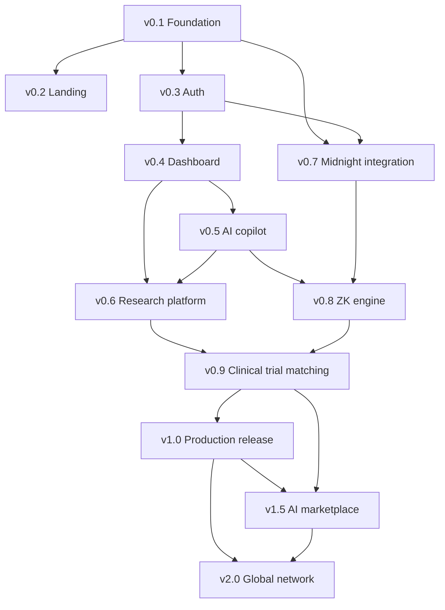

# Chorus — Development roadmap

## Purpose

This is the canonical, versioned roadmap from v0.1 through v2.0. It consolidates and formalizes the milestone planning already established across the engineering backlog and prior architecture discussions — it does not introduce new scope, and where a detail here and in the GitHub Project backlog appear to differ, the backlog's task-level detail is authoritative for anything at that level of granularity; this document is authoritative for sequencing, priority, and dependency.

## Context

Granularity is deliberately uneven, and that unevenness is itself a decision worth stating plainly: v0.1–v0.4 are specified precisely because they're built first and mistakes there are expensive to unwind; v1.0–v2.0 are specified at milestone level because task-level detail that far out would be replaced by reality before it was ever used.

## Roadmap

| Version | Milestone | Priority | Dependencies | Estimated effort |
|---|---|---|---|---|
| v0.1 | Foundation — monorepo, CI/CD, Docker scaffolding | P0 | None | 1–2 weeks, 1 engineer |
| v0.2 | Landing (placeholder) — brand shell, waitlist | P1 | v0.1 | 2 weeks, 1 engineer |
| v0.3 | Authentication — WorkOS SSO/SCIM, RBAC foundation, audit log | P0 | v0.1 | 3 weeks, 1–2 engineers |
| v0.4 | Dashboard — org/member management, cohort criteria builder (pre-circuit), developer portal | P0 | v0.3 | 4 weeks, 2 engineers + 1 designer |
| v0.5 | AI copilot — NL-to-criteria extraction, compliance flagging | P1 | v0.4 | 3–4 weeks, 1–2 engineers (LLM/agent experience required) |
| v0.6 | Research platform — sponsor cohort search (mock), access request workflow | P1 | v0.4, v0.5 | 4 weeks, 2 engineers |
| v0.7 | Midnight integration — Compact contracts on testnet, contracts-client codegen | P0 | v0.1, v0.3 | 5–6 weeks, 1–2 Midnight/ZK engineers |
| v0.8 | Zero-knowledge engine — Chorus Node MVP, proof verification pipeline, external ZK audit | P0 | v0.5, v0.7 | 8–10 weeks + 2–4 weeks external audit |
| v0.9 | Clinical trial matching — unified criteria schema, reputation scoring v1 | P1 | v0.6, v0.8 | 4–5 weeks, 2 engineers |
| v1.0 | Production release — security hardening, HIPAA BAA process, mainnet cutover, billing | P0 | All of v0.1–v0.9 | 6–8 weeks, full team (4–6 people) |
| v1.5 | AI marketplace — model passport, licensing, royalty distribution | P1 | v1.0, v0.9 reputation infrastructure | 10–12 weeks, 3–4 engineers + 1 mechanism-design consultant |
| v2.0 | Global network — multi-jurisdiction compliance engine, genomic vertical, cross-border proof aggregation | P0 (strategically) | v1.0, v1.5 | 12+ months post-v1.0, team scaling to ~10–15 |

## Dependency graph

The graph makes the roadmap's real critical path visible: v0.8 (the zero-knowledge engine) has the most upstream dependencies converging into it and the widest effort estimate, including the only externally-gated step in the entire pre-v1.0 timeline — the independent ZK audit. Any slip in v0.5 or v0.7 propagates directly into v0.8's start date, and a slip in v0.8 propagates into every milestone after it. This is why v0.8 carries a `P0` + `needs-audit` designation in the engineering backlog and is treated as the roadmap's single highest-risk item, not one risk among several equally weighted ones.

## Notes on priority

`P0` milestones are on the critical path to the next major release and are never deprioritized in favor of `P1` work in the same window — v0.2 (`P1`, the placeholder landing page) is the clearest example of a milestone that can and does slip a sprint without affecting anything downstream, precisely because nothing else in the graph depends on it. v2.0 is marked `P0` despite being over a year out because it is the product's stated long-term category-defining bet from `PRODUCT_SPEC.md`, not because any near-term milestone depends on it — priority here reflects strategic weight, not scheduling urgency.

## Version-by-version notes

**v0.1–v0.4** carry the most schedule risk of any "should be straightforward" phase, because a mistake in the monorepo structure, the auth/RBAC model, or the cohort-criteria schema is expensive to unwind once `apps/dashboard` and the AI copilot are both building on top of it — this is why the cohort criteria builder shipped in v0.4 is explicitly designed against the schema the v0.8 circuit generator will later consume, reviewed with a ZK engineer before that engineer's own work starts.

**v0.7 and v0.8** are the roadmap's technical center of gravity. v0.7 is the team's first production Compact code and should be budgeted with a real learning-curve allowance, not estimated as if the team already had Compact experience. v0.8's external audit gate is non-negotiable — no pilot institution's real data reaches the pipeline before that audit clears, regardless of internal schedule pressure, per `SECURITY_MODEL.md` and `BLOCKCHAIN_ARCHITECTURE.md`.

**v1.0** is deliberately scoped as a hardening and cutover release, not a new-feature release — everything a pilot hospital sees at v1.0 was already built and validated in v0.1–v0.9; v1.0's job is to make it production-safe (security hardening, HIPAA BAA process, mainnet re-audit) and commercially real (billing, first live payouts).

**v1.5 and v2.0** are platform-expansion releases whose exact scope is intentionally not frozen at task level yet — v1.5's royalty mechanism design and v2.0's multi-jurisdiction contract configuration are both open questions with a named owner (a mechanism-design consultant for v1.5, the Compact/ZK team for v2.0) rather than guessed-at specifications.

## Future considerations

This document is reviewed and re-baselined at the start of every major version (not every sprint) — a roadmap re-baselined too frequently stops being a planning tool and becomes a status report; re-baselining only at major version boundaries keeps it a commitment device while still allowing reality to correct it at sensible intervals.
