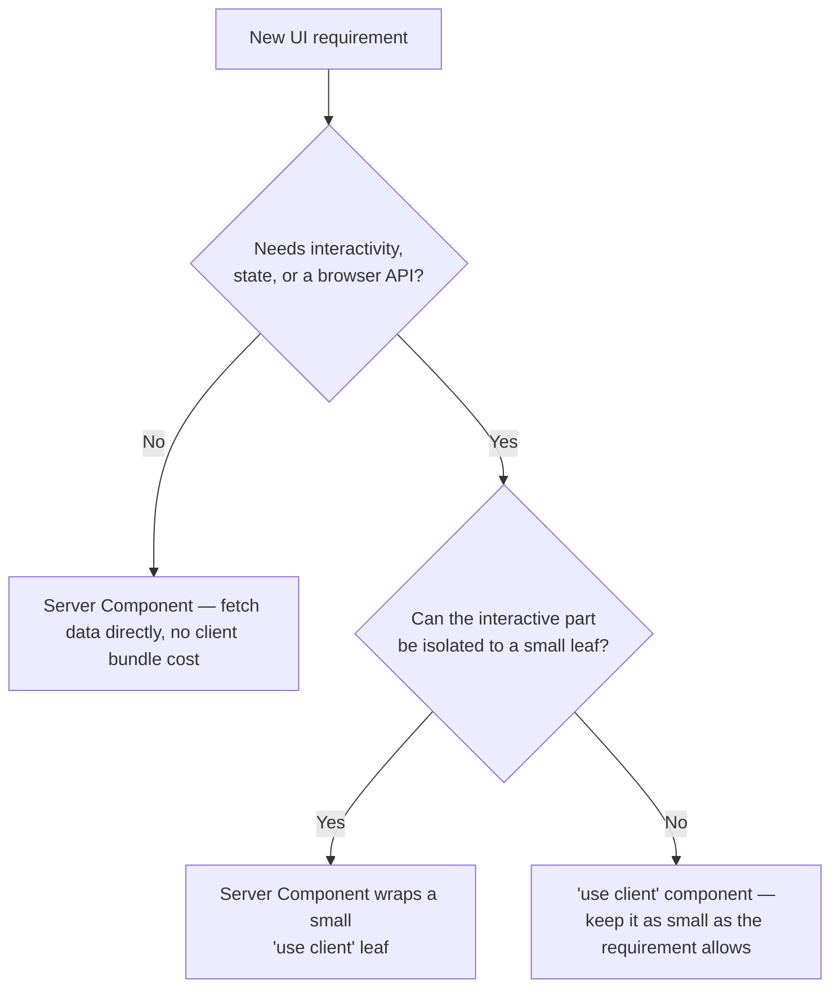

# Chorus — Frontend guidelines

## Purpose

This document governs how frontend code gets written across `apps/web`, `apps/dashboard`, `apps/research-portal`, `apps/compliance`, and `apps/admin`. It assumes `SYSTEM_ARCHITECTURE.md` (which app does what) and `DESIGN_SYSTEM.md` (which tokens exist) and focuses on the layer between them: rendering strategy, data flow, responsiveness, and performance.

## Context

Four of the five apps are enterprise tools used for hours at a time by people making compliance and clinical decisions; one is a marketing site judged in the first three seconds. Treating them identically would under-serve both. The rules below are deliberately different in places for `apps/web` versus the product apps, and each divergence is justified rather than left implicit.

## Rendering model: Server Components by default

Next.js 15 / React 19 make Server Components the default rendering unit. Chorus's rule: **a component is a Server Component unless it has a specific, nameable reason to be a Client Component** — it holds interactive state, subscribes to a browser API, or uses an effect. The reason gets a one-line comment at the top of the file.



**Do:**
```tsx
// apps/dashboard/app/cohorts/[id]/page.tsx — Server Component, no directive needed
export default async function CohortPage({ params }: { params: { id: string } }) {
  const cohort = await getCohort(params.id) // direct server-side fetch, no client waterfall
  return <CohortSummary cohort={cohort} />
}
```

**Don't:**
```tsx
// Don't mark an entire page 'use client' just because one button needs an onClick handler.
'use client'
export default function CohortPage() { /* ... */ }
```
Push `'use client'` down to the smallest leaf — a single `<ApproveButton />`, not the page that contains it.

## Data fetching patterns

Reads happen in Server Components via direct `fetch`/service calls — never through a client-side `useEffect` fetch, which introduces a waterfall and a loading-state the server render could have avoided entirely. Mutations use **Server Actions** for anything scoped to a single app (approving a cohort, updating org settings); anything that crosses an app boundary or touches the proof/contract pipeline goes through `services/api` via `packages/sdk`, never a Server Action directly, because that pipeline needs the same auth, queueing, and audit-logging path regardless of which app initiated it.

## State management

No global client-state library by default. Server state lives on the server and is re-fetched via Next.js's own caching/revalidation; UI-local state uses `useState`/`useReducer`; state that must persist across route navigation without a round-trip (e.g., a multi-step cohort-builder wizard) uses URL search params, not client state, so the state survives a refresh and is shareable as a link. Reach for a lightweight client-state library (Zustand, not Redux) only when a genuine cross-tree client concern emerges that URL state and React context can't express cleanly — treat this as an exception requiring a one-paragraph justification in the PR, not a default dependency.

## Forms

`react-hook-form` with a `zod` resolver, and the `zod` schema is imported from `packages/types` — the same schema the API validates against server-side, so client and server validation can never drift out of sync.

```tsx
import { useForm } from 'react-hook-form'
import { zodResolver } from '@hookform/resolvers/zod'
import { cohortCriteriaSchema } from '@chorus/types'

const form = useForm({ resolver: zodResolver(cohortCriteriaSchema) })
```

**Don't** hand-write a parallel validation schema in the frontend "for a quicker check" — this is exactly the kind of drift that produces a form that accepts input the API then silently rejects.

## Routing & file organization

Route groups mirror the persona, not the feature: `apps/dashboard/app/(hospital)/...` groups everything a hospital user sees, keeping layout and auth-guard logic scoped correctly. Every route segment expected to fetch data ships its own `loading.tsx`; every route segment that can fail ships its own `error.tsx` — a single global error boundary is not sufficient for apps where a failure in the cohort-builder shouldn't take down the org-settings page.

## Responsive design rules

Breakpoints follow Tailwind's defaults (`sm` 640px, `md` 768px, `lg` 1024px, `xl` 1280px). Priority differs deliberately by app:

| App | Minimum supported viewport | Rationale |
|---|---|---|
| `apps/web` | 360px, fully responsive, mobile-first | Marketing traffic is majority mobile; the scroll-driven scenes are designed to degrade to a simpler sequential reveal below `md` |
| `apps/dashboard`, `apps/research-portal` | 1024px (`lg`) as the practical floor, degrades gracefully to `md` | These are operational tools used on a desktop or laptop during working hours; investing mobile-layout effort here before v1.0 is effort better spent on the desktop experience these personas actually use |
| `apps/compliance` | 768px (`md`), print-stylesheet required | Auditors may review evidence on a tablet or need to print/export a disclosure record; a dedicated `@media print` stylesheet strips navigation chrome and renders disclosure records as clean, citable documents |
| `apps/admin` | 1024px (`lg`), no mobile requirement | Internal-only tool; no external user ever needs mobile access to it |

## Performance guidelines

Targets, not aspirations — these are enforced in CI via Lighthouse CI on every `apps/web` PR, and monitored in production via Vercel Analytics for the product apps:

- **LCP** < 2.5s, **INP** < 200ms, **CLS** < 0.1 on `apps/web`.
- Initial JS payload for `apps/web` < 150KB gzipped — the marketing site's cinematic scroll sequence must not become an excuse for a bloated bundle; heavy scroll-animation code is dynamically imported and only loads once the relevant section nears the viewport.
- All images go through `next/image` — no exceptions, no raw `` tags, so responsive sizing and format negotiation (AVIF/WebP) are automatic rather than manually re-solved per image.
- Fonts load with `next/font` and `font-display: swap`; no render-blocking font requests.
- Any data visualization heavier than a simple chart (the cohort match-rate dashboards, for example) is dynamically imported (`next/dynamic`) so its parsing cost isn't paid by users who never scroll to it.

## Accessibility rules

WCAG 2.1 AA is the floor across all apps; `apps/compliance` targets AA+ given its regulator/auditor audience. Concretely: every interactive element is reachable and operable by keyboard alone, with a visible focus ring using `--color-border-strong` (never the verify-amber accent, which is reserved for verification states, not focus states — see `DESIGN_SYSTEM.md`). Every icon-only interactive element carries an `aria-label`. Form validation errors are announced via `aria-live="polite"` regions, not conveyed by color alone. Every route has one `<h1>` and a logical heading order; landmark regions (`nav`, `main`, `aside`) are used, not `div`-soup with ARIA roles bolted on after the fact. `axe-core` runs in CI against every `packages/ui` Storybook story and fails the build on any violation — this is a merge blocker, not a warning.

## Motion usage rules

Motion (the library) handles all standard transitions using the duration/easing tokens defined in `DESIGN_SYSTEM.md`. GSAP with ScrollTrigger is reserved exclusively for the marketing site's scroll-driven mechanism scene — introducing GSAP into a product app for a dropdown animation is an unjustified dependency; Motion already covers that case. Every animation respects `prefers-reduced-motion: reduce`: redaction reveals switch from an animated wipe to an instant state change, and the marketing scroll-scene collapses to a static, sequential layout rather than attempting a reduced-motion version of a scroll-driven scene.

## Do & Don't summary

| Do | Don't |
|---|---|
| Default every component to a Server Component | Add `'use client'` to a whole page for one interactive element |
| Fetch data server-side, pass it down | Fetch in a `useEffect` when a server fetch would do |
| Import validation schemas from `packages/types` | Hand-write a parallel client-side schema |
| Match breakpoint priority to how the app is actually used | Apply the same mobile-first priority to every app regardless of its audience |
| Dynamically import heavy, below-the-fold visualizations | Ship the full bundle to every visitor regardless of what they'll use |

## Future considerations

Internationalization is out of scope for the MVP but the v2.0 multi-jurisdiction compliance engine will require it in `apps/compliance` and `apps/dashboard` at minimum — routing and copy should avoid hardcoded string concatenation now so that a `next-intl` (or equivalent) adoption later is a mechanical migration, not a rewrite. As data volume grows, `apps/research-portal`'s cohort search results are a strong candidate for React Suspense-based streaming rather than a single blocking server fetch — deferred until real usage data shows it's needed, not built speculatively now.
