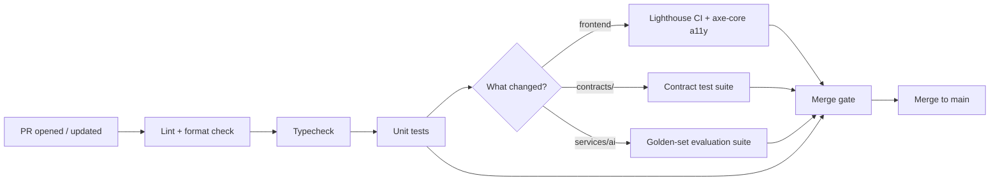

# Chorus — GitHub workflow

## Purpose

This document defines how code moves from a developer's machine to production: branching, commits, pull requests, CI, releases, environment promotion, and incident response. It extends the brief "Git & PR conventions" section in `CODING_STANDARDS.md` into the full operational process.

## Context

A small team working in a monorepo with one especially high-cost mistake surface (`contracts/`) needs a workflow that's fast for everyday frontend and service work and deliberately slower and more gated for anything touching the blockchain layer. This document encodes that asymmetry explicitly rather than applying one uniform process to work with very different risk profiles.

## Branching strategy

Trunk-based development: `main` is always deployable, and every change is a short-lived branch off `main` merged back within days, not weeks. There is no long-lived `develop` branch — a feature not ready for production ships behind a flag rather than living on a branch that drifts further from `main` the longer it exists. This is a deliberate choice for a small team: long-lived branches in a monorepo produce exactly the kind of cross-package merge conflicts (contract change, SDK change, dashboard change, all diverging independently) that the monorepo was adopted specifically to avoid — see the monorepo rationale in `SYSTEM_ARCHITECTURE.md`.

Branch names follow `type/short-description` (`feat/cohort-builder-nl-copilot`, `fix/webhook-ssrf-validation`), matching `CODING_STANDARDS.md`.

## Commits

Conventional Commits (`feat:`, `fix:`, `chore:`, `docs:`, `refactor:`, `test:`) — this is what drives `packages/*` semantic versioning via changesets, not merely a stylistic preference. A commit that changes behavior in a way a consumer of `packages/sdk` or `packages/contracts-client` should know about must be `feat:` or `fix:`, never buried in a `chore:` commit, since changesets infers version bumps from this prefix.

## Pull request process

Every PR description links the GitHub Project story it closes and states which Definition of Done items apply, per `CODING_STANDARDS.md`. Review requirements scale with risk:

| Change touches | Minimum approvals | Additional requirement |
|---|---|---|
| `apps/*`, `services/api`, `services/notifications` | 1 | Standard CI must pass |
| `services/ai` | 1 | Golden-set evaluation regression suite must pass (see `AI_ARCHITECTURE.md`) |
| `contracts/`, `packages/node` | 2 | An explicit sign-off from a ZK/Midnight engineer independent of the author (`needs-zk-signoff` label, per the engineering backlog) — this reviewer's approval is required in addition to, not instead of, the second general approval |
| `packages/config`, `packages/types` | 2 | Cross-app impact review — a change here can silently affect every app and service at once |

## CI pipeline

Turborepo's remote cache means a PR touching only `apps/web`, for example, doesn't re-run the Python service's test suite — CI cost scales with what actually changed, not with monorepo size. Every stage must pass; there is no "merge with a known-failing check and fix it later" path, since that path is exactly how a known-failing check becomes a permanently-ignored one.

## Release process

Two different things are called a "release" in this repo, deliberately kept distinct:

- **Apps** (`apps/*`) are continuously deployed — a merge to `main` deploys automatically to staging, and a manual promotion gate (see below) pushes to production. Apps are not semantically versioned as external artifacts, because nothing outside Chorus consumes an app directly.
- **Packages** (`packages/sdk`, `packages/contracts-client`, and eventually `contracts/` itself once open source) are versioned releases via changesets, because external consumers — third-party integrators, and eventually open-source contributors — depend on a stable version number and a changelog, not on "whatever is currently on `main`."

## Environment promotion

Local → staging → production, exactly as defined in `SYSTEM_ARCHITECTURE.md`'s deployment strategy. Staging deploys automatically on every merge to `main`. Production promotion for `apps/*` and `services/*` requires a named approver and a green staging smoke-test run — a manual but fast gate. Production deployment for `contracts/` is a **separate, additionally gated pipeline**, distinct from the application deploy pipeline, given the far higher cost of a contract-level mistake — a contract deploy is never bundled into the same promotion action as an application deploy, even if both happen to be ready on the same day.

## Hotfix process

A production incident gets a branch directly off the current production tag, not off `main` (which may already contain unreleased work). The fix is scoped to the minimum diff that resolves the incident, reviewed on an expedited single-approval basis but only when the PR is explicitly linked to a Sentry incident or an equivalent production alert — expedited review is a response to a real incident, not a general escape hatch from the standard process. Immediately after deployment, the hotfix is merged forward into `main` so the fix isn't silently lost on the next regular release.

## Rollback strategy

`apps/*` and `services/*` roll back instantly to the previous deployment via Vercel's and Railway/Fly.io's native rollback — no custom tooling required, since both platforms already solve this well. `contracts/` cannot be rolled back in the traditional sense once deployed to a live network; the registry pattern documented in `BLOCKCHAIN_ARCHITECTURE.md` is the rollback mechanism — the registry is repointed to the prior contract version, and historical records against the newer version remain permanently readable rather than erased.

## Do & Don't summary

| Do | Don't |
|---|---|
| Ship unfinished work behind a flag on `main` | Maintain a long-lived feature branch that drifts from `main` |
| Require independent ZK sign-off on `contracts/` and `packages/node` changes | Treat a contract change like any other PR |
| Gate contract deploys separately from application deploys | Bundle a contract release into a routine app deployment |
| Reserve expedited hotfix review for linked, real incidents | Use the hotfix path to skip review for unrelated urgent-feeling work |

## Future considerations

Canary deployments for `apps/dashboard` and `apps/research-portal` are worth adding once production traffic is high enough that a staged rollout meaningfully reduces blast radius — not before, since a canary strategy adds real operational complexity that isn't justified at pilot-institution traffic levels. Automated changelog generation from changesets output, published to `docs/public/`, is planned alongside the `packages/sdk` open-source transition, so external consumers have a reliable release history from day one of public availability rather than one reconstructed retroactively.
