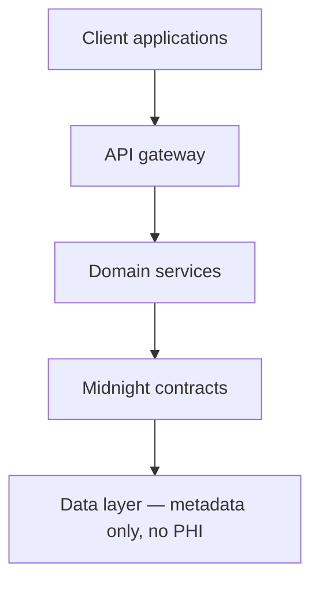

# Chorus

**Prove your hospital's data is eligible. Without showing anyone what it says.**

  

Chorus is the verification and settlement layer for confidential healthcare AI. Hospitals and biobanks train rare-disease and precision-medicine models together without raw patient data ever leaving their infrastructure — every contribution is cryptographically proven correct, automatically compensated, and disclosed only to the extent a regulator's query actually requires.

## Table of contents

- [Vision](#vision)
- [Why this project exists](#why-this-project-exists)
- [The healthcare problem](#the-healthcare-problem)
- [Why privacy matters](#why-privacy-matters)
- [Why Midnight](#why-midnight)
- [Why AI](#why-ai)
- [Core architecture](#core-architecture)
- [Repository overview](#repository-overview)
- [Technology stack](#technology-stack)
- [Screenshots](#screenshots)
- [Roadmap summary](#roadmap-summary)
- [Contributing](#contributing)
- [License](#license)

## Vision

A hospital in Rotterdam and a biobank in Osaka should be able to train the same model on the same rare disease without either one ever seeing the other's patients, and without either one having to trust a third party to keep that promise. Chorus's ten-year bet is that this is not a compliance workaround — it's how healthcare AI should have been built from the start. We want Chorus to become the layer every serious multi-institutional health AI effort runs on, the way payment infrastructure runs on Stripe: invisible when it works, and structurally impossible to get wrong when it doesn't.

## Why this project exists

Every founder in this space eventually hits the same wall: the model isn't the hard part. Getting institutions to actually contribute their data — or even their model updates — is. Federated learning has existed since 2016 and is still not the default in healthcare, not because the math doesn't work, but because the trust doesn't. A hospital that federates its training has no way to prove to its own compliance committee that a peer institution trained honestly, no way to get paid for the risk it took on, and no way to hand a regulator anything better than "trust our process." Chorus exists because we think that gap is solvable with the right cryptography, not just the right paperwork — and because Midnight is, as of 2026, the first production blockchain where that cryptography, the compliance model, and the payment rail can live in the same execution environment.

## The healthcare problem

Rare disease diagnosis takes five to seven years on average, and the bottleneck is rarely the absence of relevant cases — it's that those cases are scattered across dozens of institutions, none of which can legally or practically pool them. Federated learning was supposed to remove that bottleneck. In practice it introduces three unsolved trust problems: no participant can prove another trained honestly on genuine, eligible data (opening the door to model poisoning), there is no transparent mechanism to compensate institutions for contributing high-value cases, and gradient sharing itself leaks more about the underlying data than most institutions realize. Regulation has moved to meet this problem — the EU's Health Data Space entered into force in March 2026 with explicit provisions for secondary use of health data in algorithm development — but the technical infrastructure to use that provision safely, across borders, still does not exist as a product.

## Why privacy matters

This isn't privacy as a checkbox. A hospital that leaks patient data, even indirectly through a poorly designed federated learning pipeline, faces regulatory penalties, loses patient trust that took decades to build, and hands ammunition to every internal voice arguing that data collaboration is too risky to attempt again. Every institution we've talked to has a story about a data-sharing initiative that died because someone in the room asked "what happens if this leaks" and nobody had a good answer. Chorus's job is to make sure that question has a structural answer — not a policy — every single time.

## Why Midnight

Verifiable, compensated, auditable collaboration needs three properties in the same execution environment. No other platform we evaluated provides all three.

| Requirement | Public smart contract chains | Privacy coins | Off-chain federated learning | Midnight |
|---|---|---|---|---|
| Computation that never reveals its inputs | No — all state is public | Yes, but not programmable | Yes, but not verifiable | Yes — private state |
| Disclosure that is explicit and bounded | N/A — nothing is private to disclose | No — all-or-nothing | No — depends on a trusted operator | Yes — `disclose()` is compile-time enforced |
| Settlement that is programmable and trustless | Yes | Limited scripting | No — no native settlement layer | Yes — Compact contracts |

Midnight's Compact language makes the second row non-negotiable at the compiler level: a value cannot cross from private state into a public output, a return value, or another contract without an explicit `disclose()` call. That property is what lets us tell a hospital's compliance officer that leakage isn't a matter of us being careful — it's a matter of the contract not compiling if we get it wrong.

## Why AI

AI shows up in Chorus in three places, and we are specific about where it stops. First, the federated models hospitals actually train together are AI — that's the product. Second, a natural-language copilot helps a compliance officer turn a plain-language cohort description into a structured, reviewable specification; it never sees patient records and never persists a specification without explicit human approval. Third, the same copilot flags likely HIPAA, GDPR, or EHDS issues in a draft cohort definition against a maintained regulatory checklist, again as a suggestion a human must accept. Chorus's AI never makes an autonomous decision that touches a patient, a contract, or a payment — every one of those decisions has a human owner of record.

## Core architecture



Patient data itself never enters this diagram — it stays inside hospital infrastructure and is represented on this side only as a zero-knowledge proof. The full technical reference, including the trust-boundary and event-sequence diagrams, lives in [`SYSTEM_ARCHITECTURE.md`](./SYSTEM_ARCHITECTURE.md).

## Repository overview

```
chorus/
├── apps/            web, docs, dashboard, research-portal, compliance, admin
├── services/        api, ai, proof-worker, aggregator, notifications
├── contracts/       Compact contracts and ZK circuits (moves to open source post-audit)
├── packages/        ui, config, types, sdk, contracts-client, node, auth-client, analytics
├── docs/            public/ (rendered by apps/docs) and internal/ (never mirrored out)
└── infra/           docker, github-actions, terraform (from v1.5)
```

## Technology stack

| Layer | Technology | Why |
|---|---|---|
| Frontend | Next.js 15, React 19, TypeScript, App Router | Server-first rendering for a content-heavy marketing site and a data-heavy dashboard in one framework |
| Motion | Motion, Lenis, GSAP (scroll-driven scenes only) | Motion/Lenis cover 95% of the UI; GSAP ScrollTrigger is reserved for the one cinematic scroll sequence on the marketing site |
| UI | shadcn/ui, Radix UI, Lucide icons | Accessible primitives we theme rather than rebuild from scratch |
| Backend | NestJS, PostgreSQL, Redis, Prisma | Structured, testable service architecture; Redis backs the async proof-verification queue |
| AI | Python, FastAPI, LangGraph | The LLM/agent ecosystem lives in Python; a deliberate language boundary from the TypeScript services |
| Blockchain | Midnight, Compact, ZK circuits | See [Why Midnight](#why-midnight) |
| Auth | WorkOS | SAML/SCIM enterprise SSO is a hospital procurement requirement, not a nice-to-have |
| Infra | Turborepo, pnpm, Docker, GitHub Actions, Vercel, Railway/Fly.io | Monorepo tooling that keeps contract, SDK, and dashboard changes atomic across one PR |

## Screenshots

There is nothing to show yet, and we'd rather leave this section honest than fill it with mockups presented as product. Screenshots will be added here once the dashboard (v0.4) is live with a design-partner institution. In the meantime, the interactive disclosure-model demo referenced in [`PRODUCT_SPEC.md`](./PRODUCT_SPEC.md) is the closest thing to a live product surface we have.

## Roadmap summary

| Milestone | Focus |
|---|---|
| v0.1 – v0.4 | Foundation, auth, hospital dashboard |
| v0.5 – v0.6 | AI copilot, sponsor-facing research portal |
| v0.7 – v0.8 | Midnight contracts on testnet, zero-knowledge engine (external audit required) |
| v0.9 | Clinical trial cohort matching goes live with real proofs |
| v1.0 | Production release — mainnet, first pilot institutions |
| v1.5 | AI model marketplace and royalty distribution |
| v2.0 | Multi-jurisdiction global network |

Full milestone-level breakdown with acceptance criteria lives in the project's GitHub Project board.

## Contributing

Chorus is closed-source during the accelerator phase. `contracts/` and `packages/sdk` are scheduled to move to an open-source license once the zero-knowledge engine (v0.8) passes independent audit — see [`CONTRIBUTING.md`](./CONTRIBUTING.md) for what that process will look like once it opens.

## License

Proprietary, all rights reserved, until the v0.8 zero-knowledge engine passes external audit. At that point `contracts/` and `packages/sdk` move to an OSI-approved open-source license. The choice between MIT and Apache 2.0 is tracked as an open Architecture Decision Record (`docs/public/architecture/adr/adr-011-oss-license-choice.md`) and will be resolved before that release, not after.
