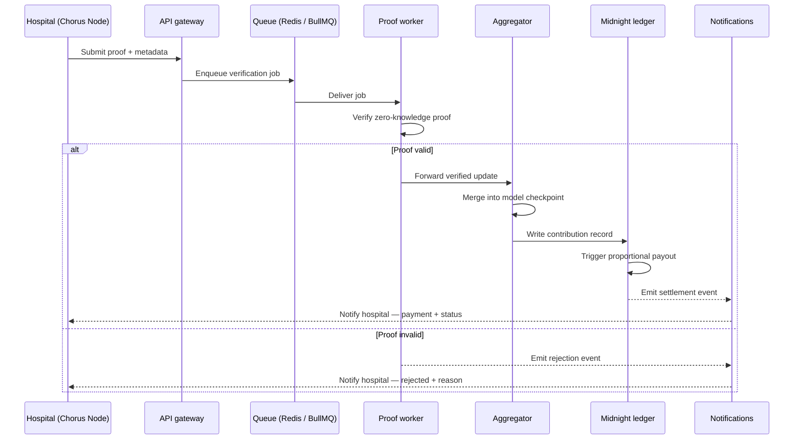
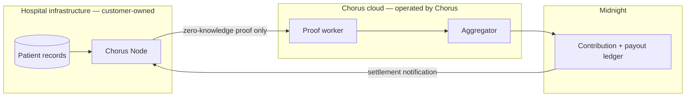

# Chorus — System architecture

This is the technical reference for the entire system. It assumes the product decisions in `PRODUCT_SPEC.md` and does not revisit them. Anywhere a decision below should be formalized as an Architecture Decision Record, it is marked **→ ADR**.

## Architecture philosophy

Three commitments shape every decision in this document, in priority order:

1. **Raw patient data never touches Chorus-operated infrastructure.** Not in a database, not in a log line, not transiently in memory on a Chorus-operated server. The only artifact that crosses the hospital boundary is a zero-knowledge proof.
2. **Disclosure is a named, reviewable event, never an implicit side effect.** Every point where a fact becomes visible outside its originating institution is an explicit `disclose()` call in a Compact contract, not an application-layer convention that could silently regress.
3. **The codebase should make the unsafe path harder to write than the safe one.** Where the first two commitments could be violated by a careless implementation, the monorepo structure, type boundaries, and CI checks are designed to catch that at build time, not at code review time.

Everything else — monorepo vs. polyrepo, service boundaries, database choices — is downstream of these three.

## Monorepo structure

Chorus is a monorepo, managed with Turborepo and pnpm workspaces, with one deliberate exception: `contracts/` is structured so it can be mirrored to a public repository once it passes external audit (v0.8), without restructuring. **→ ADR: monorepo vs. polyrepo** — the decision and its rationale (atomic cross-package changes, small team, Turborepo remote caching) should be captured formally, since it constrains every future service-boundary decision.

```
chorus/
├── apps/
│   ├── web                 marketing site
│   ├── docs                developer documentation site
│   ├── dashboard           hospital/biobank operator app (includes developer portal)
│   ├── research-portal     sponsor/CRO cohort discovery and clinical trial matching
│   ├── compliance          regulator/auditor read-only disclosure portal
│   └── admin               internal operations (onboarding, reputation, disputes)
├── services/
│   ├── api                 NestJS API gateway — auth, routing, business logic
│   ├── ai                  Python/FastAPI/LangGraph — copilot, compliance flagging
│   ├── proof-worker         ZK proof verification queue consumer
│   ├── aggregator           federated update merging (FedAvg-derived)
│   └── notifications        email, webhook, in-app notification delivery
├── contracts/
│   ├── compact              Compact contract source
│   ├── circuits              ZK circuit definitions
│   ├── scripts                deploy/migration scripts
│   └── tests                  contract test suite
├── packages/
│   ├── ui                    shared design-system components (shadcn-based)
│   ├── config                 shared eslint/tsconfig/tailwind config
│   ├── types                   shared TypeScript types and zod schemas
│   ├── sdk                      @chorus/sdk — external developer integration
│   ├── contracts-client          generated typed bindings from Compact contracts
│   ├── node                       Chorus Node runtime — deployed inside hospital infrastructure
│   ├── analytics                   product-event tracking abstraction (never patient data)
│   └── auth-client                  shared WorkOS auth client logic
├── docs/
│   ├── public                       rendered by apps/docs; mirrors to open source with contracts/
│   └── internal                     never rendered publicly, never mirrored
└── infra/
    ├── docker                       per-service Dockerfiles
    ├── github-actions                reusable CI workflows
    └── terraform                     reserved for v1.5+, not used pre-v1.0
```

## Applications

| App | Users | Responsibility | Notes |
|---|---|---|---|
| `web` | Public | Marketing, brand, waitlist | Independent deploy cadence from the product apps |
| `docs` | Developers | Renders `docs/public/` | Source and presentation are deliberately separated |
| `dashboard` | Hospital admin, clinician, compliance officer | Org/member management, cohort criteria drafting, API keys and webhooks, contribution/earnings views | Absorbs what would otherwise be a separate "developer portal" — same user, same session, no reason to split |
| `research-portal` | CRO/sponsor clinical operations | Cohort search, access requests, clinical trial matching | Absorbs what the original brief called a separate "clinical trial portal" — same persona, same underlying criteria schema |
| `compliance` | Regulator/auditor | Read-only, scoped `disclose()` query interface | Isolated deliberately: different authorization model, different audit-log depth than `dashboard` |
| `admin` | Internal Chorus team | Institution onboarding, reputation scoring, dispute resolution | Never exposed to hospital or sponsor users |

## Packages

| Package | Purpose | Consumed by |
|---|---|---|
| `ui` | Themed shadcn/Radix component library | All `apps/*` |
| `config` | Shared lint/TS/Tailwind configuration | Every workspace |
| `types` | Shared TypeScript types and zod schemas — the API/frontend contract | `apps/*`, `services/api` |
| `sdk` | External developer-facing integration SDK | Third-party integrators (post open-source) |
| `contracts-client` | Codegen'd typed bindings from Compact contract schemas | `services/api`, `apps/dashboard` |
| `node` | The Chorus Node runtime: local training harness + proof generation | Distributed to, and run inside, hospital infrastructure |
| `analytics` | Product event-tracking abstraction | All `apps/*` |
| `auth-client` | Thin abstraction over WorkOS | All `apps/*`, `services/api` |

## Backend services

**`services/api` (NestJS)** is the single synchronous entry point for all client applications. It owns authentication session handling, request routing, and business logic that does not require heavy or slow computation. It never performs proof verification or model aggregation directly — those are handed off to the async queue.

**`services/proof-worker`** consumes verification jobs from a Redis-backed queue (BullMQ). It validates a submitted zero-knowledge proof, rejects invalid or tampered submissions with a logged reason, and forwards valid ones to the aggregator. It is deliberately decoupled from `services/api` because proof verification latency (seconds to minutes, depending on circuit complexity) is incompatible with holding open an HTTP request.

**`services/aggregator`** merges verified local model updates into a shared checkpoint (a FedAvg-derived merge strategy for the MVP) and writes the resulting contribution record to the Midnight ledger.

**`services/notifications`** delivers email, webhook, and in-app notifications for events such as proof acceptance/rejection and payout settlement. It is a single service handling three channels rather than three separate services, because channel-per-service would be premature scaling for the current event volume.

## AI services

`services/ai` (Python, FastAPI, LangGraph) hosts two capabilities, both explicitly bounded per the product principle that AI assists but never decides:

1. **Natural-language-to-criteria copilot** — converts a plain-language cohort description into a structured draft matching the schema `packages/types` defines, requiring explicit human review before persistence. No draft this service produces is ever auto-saved.
2. **Compliance flagging** — checks a draft cohort definition against a maintained HIPAA/GDPR/EHDS checklist and surfaces likely issues with a rationale. It flags; it does not block or approve.

`services/ai` never receives patient records, gradients, or proof contents — its inputs are limited to structured criteria text and metadata.

## Blockchain layer

Three Compact contracts form the MVP's on-chain surface:

- **Eligibility record contract** — stores a hospital's zero-knowledge-proven attestation that a defined cohort criterion is met, without storing the underlying patient data or count.
- **Contribution ledger contract** — records a verified federated-learning contribution (a hash of the model update and proof metadata, not the update itself).
- **Payout contract** — triggers an automatic, contribution-proportional payment on a valid contribution record.

Two ZK circuit families support these contracts: an **eligibility circuit**, which proves a cohort criterion is satisfied, and a **training-correctness circuit**, which proves a local model update was computed correctly on eligible data (adapted from the VPFL/TrustDFL family of academic constructions). Every contract that touches either circuit family defines its `disclose()` points explicitly and in advance — **→ ADR: disclosure boundary specification per contract**, since this is the artifact regulators and hospital compliance officers will ask to review before onboarding.

## Database layer

PostgreSQL (via Prisma) holds metadata only — never patient data, never raw model gradients, never proof witnesses. Key table categories:

| Table category | Purpose |
|---|---|
| `organizations`, `memberships`, `roles` | Multi-tenant identity, mirrored from WorkOS |
| `audit_log` | Append-only record of every auth and disclosure-relevant event |
| `cohort_drafts` | Structured criteria drafts pending human review (never patient-level data) |
| `contribution_records` | Off-chain mirror of on-chain contribution records, for fast dashboard queries |
| `api_keys`, `webhooks` | Developer portal configuration |
| `notifications` | Delivery log for the notifications service |

Redis backs two distinct concerns that are kept logically separate despite sharing infrastructure: the BullMQ verification/aggregation queue, and short-lived application cache. **→ ADR: Postgres schema is metadata-only by design** — this constraint is significant enough, and easy enough to accidentally violate under feature pressure, that it deserves its own ADR rather than living only in this document.

## Authentication

WorkOS provides enterprise SSO (SAML) and directory sync (SCIM), fronted by `packages/auth-client`. This is a deliberate build-vs-buy decision: hospital IT procurement treats SSO/SAML support as a checkbox requirement, and building a compliant SAML implementation in-house is not where an early-stage team's engineering time belongs. A magic-link fallback exists for early pilot institutions not yet ready to configure SSO. **→ ADR: WorkOS as the identity provider** — alternatives considered (custom SAML, Clerk) and the rationale for WorkOS specifically (SCIM support, SOC2 posture) should be recorded.

## Authorization

Role-based access control, enforced at the NestJS guard layer, with five roles: `hospital_admin`, `clinician`, `compliance_officer`, `sponsor`, `chorus_admin`, plus a read-only `regulator` role scoped to `apps/compliance` only. A `regulator` role can never authenticate into `apps/dashboard`, `apps/research-portal`, or `apps/admin` — this is enforced at the application routing layer, not only the API layer, so a misconfigured single sign-on group cannot silently grant broader access than intended.

## Event flow



## Data flow



The only element that crosses the hospital boundary in either diagram is a proof. This is the architectural claim the entire product's trust story rests on, and it should be treated as immutable: any future feature proposal that would require patient data to cross that boundary, even transiently, is out of architecture by default and requires an explicit, documented exception process.

## Deployment strategy

`apps/*` deploy to Vercel, independently, on merge to `main`. `services/api`, `services/proof-worker`, `services/aggregator`, and `services/notifications` deploy to Railway or Fly.io — chosen over a heavier orchestration platform (e.g., Kubernetes) because the team size and service count through v1.0 don't justify that operational overhead. `packages/node` is distributed as a versioned Docker image for hospitals to run inside their own infrastructure — Chorus never operates this workload directly. Three environments exist: local (Docker Compose), staging (mirrors production, used for pilot institution UAT), and production. Contract deployment (`contracts/scripts`) is a separate, manually-gated pipeline distinct from application deploys, given the higher cost of a contract-level mistake.

## Infrastructure

Docker Compose covers local development for all services including the Python AI service. CI/CD runs on GitHub Actions, with a separate lint/test lane for the Python service so unrelated Node changes don't trigger Python builds and vice versa. Error tracking uses Sentry from v0.3 onward. Log aggregation and basic metrics use a hosted provider (evaluated: Axiom, Better Stack) rather than a self-hosted Prometheus/Grafana stack — self-hosting observability infrastructure before there is meaningful production traffic is effort better spent elsewhere. Terraform is explicitly deferred to v1.5+, once infrastructure surface area justifies infrastructure-as-code overhead; before that, infrastructure is provisioned directly through each provider's dashboard and documented in `docs/internal/deployment/`.

## Folder structure

See [Monorepo structure](#monorepo-structure) above for the annotated tree. The one rule worth restating here: any file under `docs/internal/` or any table in the Postgres schema that could plausibly contain patient-level data is a defect, not a style violation, and blocks merge under the Definition of Done regardless of who approved the PR.

## Technology decisions

| Decision | Alternatives considered | Chosen | Why |
|---|---|---|---|
| Monorepo | Polyrepo | Monorepo (Turborepo/pnpm) | Atomic cross-package changes (contract → SDK → dashboard); small team doesn't need polyrepo's isolation benefits yet — **→ ADR** |
| Identity provider | Custom SAML, Clerk | WorkOS | SCIM + SAML are hospital procurement requirements; not worth building in-house — **→ ADR** |
| API style | GraphQL | REST + zod-validated types | End-to-end type safety already exists via `packages/types`; GraphQL's flexibility isn't worth its complexity at this scale |
| Async processing | Synchronous request handling | Redis/BullMQ queue | Proof verification latency (seconds–minutes) is incompatible with holding an HTTP request open |
| AI service language | TypeScript (single-language repo) | Python (FastAPI/LangGraph) | The LLM/agent tooling ecosystem lives in Python; a clean language boundary beats forcing a mismatched ecosystem into NestJS |
| Research portal vs. clinical trial portal | Two separate apps | One app (`research-portal`) | Same persona, same criteria schema, same sales motion — splitting them would create a false product boundary — **→ ADR** |
| Contracts open-source timing | Open source from day one; never open source | Open source post-v0.8 audit | Circuit correctness is core to the trust story and should be publicly auditable, but not before it has passed independent review |
| Infrastructure-as-code | Terraform from day one | Deferred to v1.5+ | Infrastructure surface area pre-v1.0 doesn't justify the overhead |

## Future scalability

Beyond v1.0, three scaling questions are already visible and deliberately deferred rather than ignored: `proof-worker` will need horizontal scaling once verification volume grows past a single queue consumer's throughput, most likely sharded by disease vertical rather than by hospital, since verification load correlates with active cohort count, not institution count. The `aggregator` will need a similar sharding strategy once multiple disease verticals run concurrent training rounds. And the multi-jurisdiction compliance engine planned for v2.0 will require the disclosure model in the Compact contracts to express country-specific rules as configuration rather than as contract forks — a requirement that should inform circuit design decisions made as early as v0.8, even though the multi-jurisdiction feature itself is two years out.
